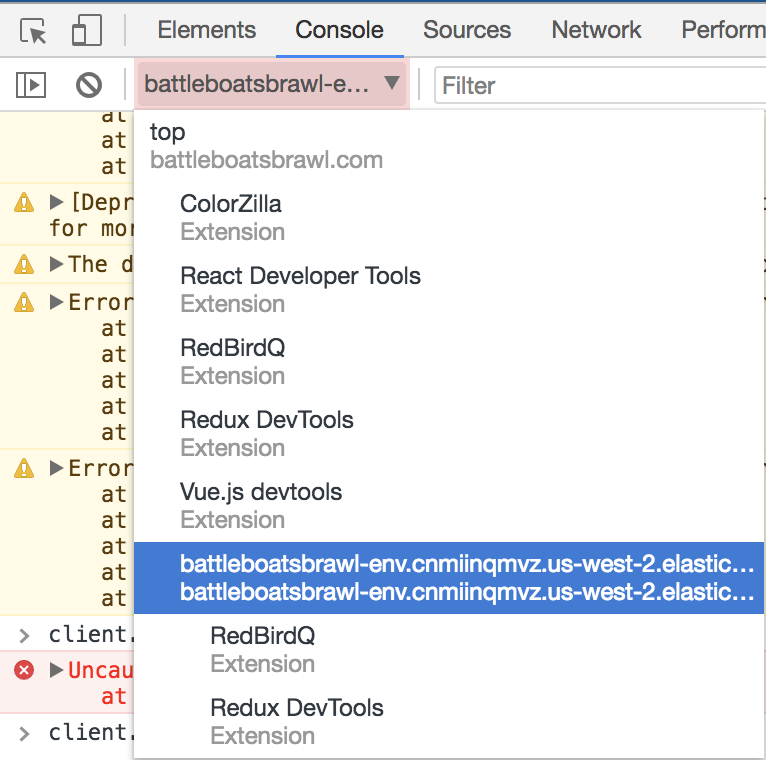

# Battle Boats Brawl

[battleboatsbrawl.com](http://www.battleboatsbrawl.com)

[github repo](https://github.com/nicholas-guyaux/cs5410_final)

Requirements:

Node.js version with async/await.  
I believe this means you need Node.js 8 or greater.

Andrew Aposhian  
Sam Christiansen  
Nicholas Guyaux  
John Johnson  

With help from Dr. Dean Mathias

### Client Prediction and Server Reconciliation
In client_files/js/views/GameView.js

* Client prediction starts with `messageHistory.enqueue(message);` lines in the function `render()` (Note that `render()` is essentially the view setup)

* Server reconciliation is in the `updatePlayerSelf(data)` function

### Entity Interpolation
In client_files/js/views/GameView.js

* In `updatePlayerOther(data)`
* Line 543 calls the update function defined in In client_files/js/components/player-other.js

### Changing number of required players

Number of required players can be changed by restarting the server by changing the number in `server/config.js`.

Number of required players can be dynamically changed without restarting the server by typing `client.changeNumRequiredPlayers(4)` in the browser console where `4` is the new number of players to start the game with.

`client` may not be defined on your console. In this case you may need to change the context of the console. You can do this in chrome by clicking the following context shown in the below image.

